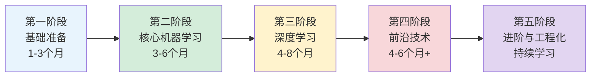

# 人工智能算法学习路线图

> 本文档基于 `docs/人工智能算法学习路线图.pdf` 整理，并对各阶段时间安排的合理性进行了评估与优化建议。

---

## 一、学习进度合理性评估

### 总体结论

**整体结构合理，适合作为从零到进阶的系统化路线。** 五阶段划分（基础 → 经典 ML → 深度学习 → 前沿方向 → 工程与研究）符合业界主流培养路径，内容与 2026 年技术趋势（大语言模型、RAG、AI Agent、MLOps）基本对齐。

**若按顺序完整学完，预计总时长约 12～23 个月**（各阶段取下限/上限相加：1～3 + 3～6 + 4～8 + 4～6 + 持续）。对在职转行者偏紧，对学生或全职学习者较合适。

### 分阶段评估

| 阶段 | 原计划时长 | 合理性 | 说明 |
|------|-----------|--------|------|
| 第一阶段：基础准备 | 1～3 个月 | ⚠️ 偏紧（零基础） / ✅ 合理（有编程基础） | 数学三件套 + Python + 数据分析，零基础 3 个月只能「入门」，难以「扎实」 |
| 第二阶段：核心机器学习 | 3～6 个月 | ✅ 合理 | 经典算法 + Scikit-learn 实战，时长与内容匹配 |
| 第三阶段：深度学习 | 4～8 个月 | ⚠️ 偏长但可接受 | 内容广（框架 + CNN + RNN + 强化学习实践），可压缩至 3～5 个月（有 ML 基础时） |
| 第四阶段：前沿技术 | 4～6 个月+ | ✅ 合理（需聚焦） | LLM / Agent / RAG 任一方向均可占满该阶段，不宜「全学」 |
| 第五阶段：进阶与工程化 | 持续学习 | ✅ 合理 | 作为长期能力建设，与职业发展同步 |

### 主要优点

1. **循序渐进**：强调数学与编程基础，不跳过底层能力。
2. **理论与实践并重**：每个阶段都包含动手实践（Scikit-learn、PyTorch、Kaggle 等）。
3. **紧跟趋势**：涵盖 Transformer、生成式 AI、RAG、向量数据库、LoRA 微调、AI Agent。
4. **职业导向**：包含 MLOps、云平台、竞赛作品集、AI 伦理等工程与软技能。

### 需要改进的地方

1. **内容顺序略有错位**
   - 强化学习「范式」在第二阶段，但「OpenAI Gym 实践」在第三阶段，建议合并到同一阶段。
   - Transformer 是当代深度学习核心，放在第四阶段偏晚；建议在第三阶段末或第四阶段初优先学习。

2. **时间表述易产生误解**
   - 各阶段时长为「独立区间」而非「累计」，建议在计划中明确是**串行累计**还是**可并行**。
   - 有 CS / 数学背景者，第一、二阶段可各压缩 30%～50%。

3. **部分基础未单独列出**
   - 建议补充：**数据结构与算法**、**Git 版本控制**、**Linux 基础命令**，这些对后续工程化至关重要。

4. **RNN/LSTM 的定位**
   - 仍需学习（理解序列建模思想），但 NLP 主线应更快过渡到 **Transformer**，避免在 RNN 上花费过多时间。

5. **第四阶段范围过大**
   - LLM、扩散模型、GAN、多模态、Agent、RAG、向量库、微调、三大应用领域——不可能在 4～6 个月内全部深入。
   - **建议选定 1～2 个主攻方向**，其余作为扩展阅读。

### 不同背景的推荐节奏

| 背景 | 建议总时长 | 调整策略 |
|------|-----------|----------|
| 零基础（无编程、无数学） | 18～24 个月 | 第一阶段延长至 4～6 个月；深度学习阶段不赶进度 |
| 有编程基础（会 Python） | 12～18 个月 | 压缩第一阶段至 1～2 个月；加强项目实战 |
| 计算机/数学相关专业 | 8～12 个月 | 快速过基础；重点放在第三、四阶段与作品集 |
| 在职转行（每天 1～2 小时） | 24～36 个月 | 按周计划拆分；每阶段结束做 1 个小项目验收 |

> **在职转行详细周计划**：见 [`在职转行周计划.md`](在职转行周计划.md)（约 130 周 / 30 个月，含每周任务与阶段验收）。  
> **可打勾进度清单**：见 [`学习进度清单.md`](学习进度清单.md) · 当前进度 [`progress/当前进度.md`](progress/当前进度.md)

---

## 二、完整学习计划

### 学习路径总览



---

### 第一阶段：基础准备（建议 1～3 个月，零基础可延长至 4～6 个月）

**目标**：建立数学与编程基础，理解人工智能的基本概念。

#### 1. 数学基础

| 主题 | 核心内容 | 学习要点 |
|------|----------|----------|
| 线性代数 | 向量、矩阵、张量、特征值/特征向量 | 为神经网络与 PCA 等降维打基础 |
| 概率与统计 | 概率分布、贝叶斯定理、假设检验、最大似然估计 | 为 ML 损失函数与模型评估打基础 |
| 微积分 | 导数、偏导数、梯度、链式法则 | 为反向传播与优化算法打基础 |

#### 2. 编程基础

- **Python 核心**：语法、数据结构（列表、字典、集合）、函数、面向对象基础
- **常用库**：NumPy（数值计算）、Pandas（数据处理）
- **数据操作**：数据清洗、探索性分析、可视化（Matplotlib / Seaborn）
- **补充建议**：Git 基础、Jupyter Notebook 使用

#### 3. 人工智能导论

- AI 的定义、发展历史、主要分支
- 机器学习、深度学习、NLP、计算机视觉的关系
- AI 与传统编程（规则驱动 vs 数据驱动）的区别

#### 阶段验收

- [ ] 能用 Pandas 完成一次完整的数据清洗与分析
- [ ] 能手写矩阵乘法、梯度计算的小例子
- [ ] 能用自己的话解释「什么是机器学习」

---

### 第二阶段：核心机器学习算法（建议 3～6 个月）

**目标**：掌握经典机器学习范式与算法，建立模型训练与评估的完整流程。

#### 1. 学习范式

| 范式 | 用途 | 典型任务 |
|------|------|----------|
| 监督学习 | 有标签数据 | 分类、回归 |
| 无监督学习 | 无标签数据 | 聚类、降维 |
| 强化学习（入门） | 序列决策 | 游戏、机器人控制（概念层面） |

#### 2. 核心算法

**监督学习**

- 线性模型：线性回归、逻辑回归
- 基于树的模型：决策树、随机森林、梯度提升树（XGBoost / LightGBM）
- 支持向量机（SVM）

**无监督学习**

- 聚类：K-Means、DBSCAN
- 降维：PCA（主成分分析）

#### 3. 模型实践（Scikit-learn）

- 数据划分：训练集 / 验证集 / 测试集
- 模型训练、交叉验证、超参数调优
- 评估指标：准确率、精确率、召回率、F1、AUC-ROC
- 理解过拟合与欠拟合，掌握正则化思路

#### 阶段验收

- [ ] 在 Kaggle 入门数据集上完成一次端到端 ML 项目
- [ ] 能解释至少 3 种算法的适用场景与优缺点
- [ ] 能绘制学习曲线并判断过拟合/欠拟合

---

### 第三阶段：深度学习与神经网络（建议 4～8 个月，有基础可压缩至 3～5 个月）

**目标**：掌握深度学习核心原理，能使用主流框架构建和训练神经网络。

#### 1. 神经网络基础

- 感知机、多层感知机（MLP）
- 激活函数：ReLU、Sigmoid、Softmax
- 反向传播算法
- 优化算法：SGD、Momentum、Adam
- 正则化：Dropout、Batch Normalization

#### 2. 深度学习框架

- 熟练使用 **PyTorch** 或 **TensorFlow** 之一（推荐 PyTorch）
- 掌握：张量操作、自动求导、DataLoader、训练循环编写

#### 3. 经典网络架构

| 架构 | 适用领域 | 代表任务 |
|------|----------|----------|
| CNN（卷积神经网络） | 计算机视觉 | 图像分类、目标检测 |
| RNN / LSTM / GRU | 序列数据 | 时间序列、文本（理解思想即可，NLP 主线转向 Transformer） |
| Transformer（建议在本阶段末引入） | NLP / 多模态 | 文本理解、生成 |

#### 4. 强化学习实践（可选）

- 使用 OpenAI Gym 等环境进行基础 RL 实验
- 了解 Q-Learning、Policy Gradient 基本概念

#### 阶段验收

- [ ] 用 PyTorch 从零实现一个 CNN 并完成 CIFAR-10 分类
- [ ] 理解并能口述反向传播流程
- [ ] 完成一个 Kaggle 深度学习相关比赛（不要求高排名）

---

### 第四阶段：前沿技术与专业领域（建议 4～6 个月+，需选定主攻方向）

**目标**：跟进当前热点技术，在 1～2 个专业方向形成深度能力。

> **重要**：本阶段内容广，请选定主攻方向，避免「样样学、样样浅」。

#### 1. 当前热点技术（必学核心）

| 技术 | 核心内容 |
|------|----------|
| 大语言模型（LLM） | Prompt 工程、API 调用、模型能力边界 |
| Transformer 架构 | 自注意力机制、Encoder-Decoder、位置编码 |
| 生成式 AI | 扩散模型（Diffusion）、生成对抗网络（GAN）概念 |
| 多模态学习 | 文本 + 图像 + 音频的联合理解 |
| AI 智能体（Agent） | 规划、工具调用、ReAct 等范式 |

#### 2. 关键技术栈

| 技术 | 用途 |
|------|------|
| RAG（检索增强生成） | 将外部知识库与 LLM 结合，减少幻觉 |
| 向量数据库 | 高效存储与检索嵌入向量（如 Milvus、Chroma、FAISS） |
| 模型微调 | LoRA、QLoRA 等参数高效微调方法 |
| Hugging Face 生态 | 模型下载、推理、微调、部署 |

#### 3. 专业应用领域（任选 1～2 个深入）

**自然语言处理（NLP）**

- 文本分类、情感分析、命名实体识别
- 机器翻译、文本摘要、问答系统

**计算机视觉（CV）**

- 目标检测（YOLO 系列）、图像分割
- 人脸识别、OCR

**强化学习应用**

- 游戏 AI、机器人控制、自动驾驶仿真

#### 阶段验收

- [ ] 搭建一个完整的 RAG 问答系统（含向量检索）
- [ ] 使用 LoRA 微调一个小型开源 LLM
- [ ] 完成一个 Agent 小项目（如工具调用 + 任务规划）
- [ ] 在选定领域完成 1 个可展示的项目

---

### 第五阶段：进阶研究与工程化（持续学习）

**目标**：将 AI 能力应用于复杂真实问题，建立长期竞争力。

#### 1. 发展中的技术

- 可解释 AI（XAI）
- 因果推理（Causal Inference）
- 神经架构搜索 / AutoML
- 联邦学习（Federated Learning）
- 边缘 AI（Edge AI）

#### 2. 未来研究方向（拓展视野）

- 通用人工智能（AGI）
- 神经符号融合
- 具身智能（Embodied AI）
- 量子机器学习

#### 3. 工程与实践

| 方向 | 内容 |
|------|------|
| MLOps | 模型部署、监控、CI/CD、版本管理 |
| 云平台 | 阿里云 PAI、AWS SageMaker、Google Vertex AI |
| 项目与竞赛 | Kaggle 比赛、开源贡献、个人作品集 |
| AI 伦理与治理 | 公平性、偏见、隐私、负责任的 AI 使用 |

#### 持续学习建议

- 跟踪 arXiv 预印本与顶会（NeurIPS、ICML、ICLR、CVPR、ACL）
- 参与 Hugging Face、GitHub 开源社区
- 定期复盘与更新个人学习路线图

---

## 三、学习建议

### 1. 循序渐进

不要跳过基础阶段。扎实的数学与编程能力是后续快速进步的前提。

### 2. 动手实践

理论学习必须配合代码实现与项目练习。**写代码是掌握算法的唯一可靠途径。**

### 3. 关注社区

- 论文：arXiv、Google Scholar
- 会议：NeurIPS、ICML、CVPR、ACL
- 开源：Hugging Face、PyTorch、LangChain

### 4. 构建知识体系

- 参考系统化课程（如斯坦福 CS229、CS231n、fast.ai）
- 使用思维导图整理每个阶段的知识点
- 每完成一个阶段，写一份学习总结

### 5. 持续学习

AI 领域发展迅猛，保持好奇心与学习习惯，**定期更新本路线图**。

### 6. 学习-实践-总结循环

```
学习理论 → 动手编码 → 做小项目 → 写总结复盘 → 进入下一阶段
```

---

## 四、推荐学习资源

| 类型 | 资源 |
|------|------|
| 数学基础 | 3Blue1Brown 线性代数系列、MIT 微积分、统计学习方法（李航） |
| 机器学习 | 吴恩达 Machine Learning（Coursera）、Hands-On ML（O'Reilly） |
| 深度学习 | 吴恩达 Deep Learning 专项、fast.ai、动手学深度学习（李沐） |
| LLM / Agent | Hugging Face Course、LangChain 文档、OpenAI Cookbook |
| 实战平台 | Kaggle、阿里云 AI 学习路线、Google Colab |
| 论文追踪 | arXiv.org、Papers With Code |

---

## 五、个性化调整指南

原路线图适用于大多数学习者，但你可以根据自身情况调整：

| 你的情况 | 建议 |
|----------|------|
| 时间有限 | 第四阶段只选 1 个方向；第五阶段按需学习 |
| 目标是就业 | 加强第三、四阶段项目；尽早开始作品集 |
| 目标是科研 | 加强数学与论文阅读；第五阶段提前介入 |
| 已有编程经验 | 第一阶段压缩至 2～4 周；尽快进入项目驱动学习 |
| 在职转行 | 使用 [`在职转行周计划.md`](在职转行周计划.md)；每周 10～12 小时，约 130 周完成 |

**核心原则**：保持「学习 → 实践 → 总结」的循环，逐步建立属于自己的 AI 算法知识体系。

---

## 参考来源

本路线图整理自 `docs/人工智能算法学习路线图.pdf`，原始参考包括：

- Principles & Fundamentals of Mastering AI / ML
- 初学者终极 AI-ML 路线图
- 2026 年 Agentic AI 工程师完全指南
- AI 算法全回顾：从理论到实践的知识体系
- 阿里云 AI 学习路线
- Developing Large AI Models Training Course
- 人工智能学习路线脑图（苏黎世联邦理工学院等）

---

*最后更新：2026 年 6 月*
