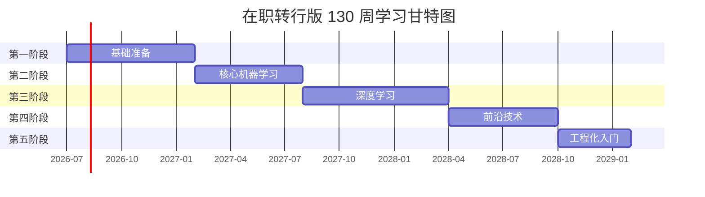

# 人工智能算法学习 · 在职转行版周计划

> 适用人群：在职人员，每天可投入 **1～2 小时**（工作日）+ **周末半天～1 天**  
> 预计总时长：**约 130 周（30 个月）**  
> 每周有效学习时间：**约 10～12 小时**  
> 主线学习指南：[`readme.md`](readme.md)

---

## 一、使用说明

### 1.1 时间假设

| 时段 | 建议时长 | 适合做什么 |
|------|----------|------------|
| 工作日（每晚） | 1～1.5 小时 | 看视频、读文档、写小代码 |
| 周六 | 3～4 小时 | 做项目、写完整脚本 |
| 周日 | 2～3 小时 | 复盘、整理笔记、补漏 |

**每周合计：约 10～12 小时。** 若你只能达到 8 小时/周，请将整体计划顺延约 25%。

### 1.2 每周固定节奏（推荐）

```
周一～周三：学理论 + 跟练示例代码
周四～周五：做本章练习题 / 小实验
周六：项目实战（本周最重要）
周日：复盘笔记 + 预习下周（30 分钟）
```

### 1.3 阶段与周数总览

| 阶段 | 周次 | 周数 | 日历约计 | 阶段结束项目 |
|------|------|------|----------|--------------|
| 第一阶段：基础准备 | W1～W28 | 28 周 | 第 1～7 月 | 数据分析报告 |
| 第二阶段：核心机器学习 | W29～W54 | 26 周 | 第 8～13 月 | Kaggle 端到端 ML 项目 |
| 第三阶段：深度学习 | W55～W88 | 34 周 | 第 14～21 月 | PyTorch CNN + DL 作品集项目 |
| 第四阶段：前沿技术 | W89～W114 | 26 周 | 第 22～27 月 | RAG + Agent + LoRA 微调项目 |
| 第五阶段：工程化入门 | W115～W130 | 16 周 | 第 28～30 月 | 可部署的 AI 应用 + 作品集 |
| 持续学习 | W131+ | 持续 | 第 31 月起 | 竞赛 / 开源 / 求职 |



### 1.4 三条重要原则

1. **不要跳周**：在职学习最怕「追进度」，宁可顺延也不要跳过基础。
2. **周六必做项目**：理论看再多，没有周六的项目产出，很容易「看过即忘」。
3. **每 4 周一复盘**：对照下方验收清单，不合格就延长该模块，不要硬进下一阶段。

---

## 二、第一阶段：基础准备（W1～W28，约 7 个月）

**阶段目标**：掌握 Python 数据分析能力，补齐 AI 所需的数学直觉，理解 ML 基本概念。

**阶段验收**：
- [ ] 独立完成一份 Pandas 数据分析报告（含可视化）
- [ ] 手写矩阵乘法 + 简单梯度下降
- [ ] 向他人解释「监督学习 vs 无监督学习」

---

### W1：环境搭建与 Git 入门

| 天 | 任务 |
|----|------|
| 周一 | 安装 Anaconda / Miniconda、VS Code、Jupyter |
| 周二 | 学习 Git 基础：`init`、`add`、`commit`、`push` |
| 周三 | 注册 GitHub，创建学习仓库 |
| 周四 | Python 变量、数据类型、输入输出 |
| 周五 | 条件语句 `if/else`、循环 `for/while` |
| 周六 | **项目**：用 Python 写「猜数字游戏」+ 推送到 GitHub |
| 周日 | 整理环境配置笔记，预习 NumPy |

**本周产出**：GitHub 上有第一个仓库，Jupyter 能正常运行。

---

### W2：Python 核心语法

| 天 | 任务 |
|----|------|
| 周一 | 列表 `list`：增删改查、切片 |
| 周二 | 字典 `dict`、集合 `set`、元组 `tuple` |
| 周三 | 函数定义、参数、返回值 |
| 周四 | 列表推导式、lambda 表达式 |
| 周五 | 文件读写（txt、csv） |
| 周六 | **项目**：读取 CSV 文件，统计其中数值列的均值/最大值 |
| 周日 | 复盘 Python 基础，做 10 道练习题 |

---

### W3：Python 进阶

| 天 | 任务 |
|----|------|
| 周一 | 模块与包、`import` 机制 |
| 周二 | 面向对象基础：类、对象、方法 |
| 周三 | 异常处理 `try/except` |
| 周四 | 常用标准库：`os`、`json`、`datetime` |
| 周五 | 复习 W1～W3，查漏补缺 |
| 周六 | **项目**：面向对象版「学生成绩管理系统」（增删查） |
| 周日 | 休息或补漏 |

---

### W4：NumPy 入门

| 天 | 任务 |
|----|------|
| 周一 | NumPy 数组创建、`shape`、`dtype` |
| 周二 | 数组索引、切片、布尔索引 |
| 周三 | 数组运算：加减乘除、广播机制 |
| 周四 | 聚合函数：`sum`、`mean`、`max`、`argmax` |
| 周五 | 线性代数：`dot`、`transpose`、`linalg.norm` |
| 周六 | **项目**：用 NumPy 实现矩阵乘法（不用 `np.dot`） |
| 周日 | 整理 NumPy 速查表 |

---

### W5：Pandas 入门

| 天 | 任务 |
|----|------|
| 周一 | Series 与 DataFrame 创建 |
| 周二 | 读取 CSV/Excel、`head`、`info`、`describe` |
| 周三 | 列选择、行过滤、条件查询 |
| 周四 | 缺失值处理：`isna`、`fillna`、`dropna` |
| 周五 | 数据类型转换、重复值处理 |
| 周六 | **项目**：清洗一份脏数据（Kaggle Titanic 数据集预览） |
| 周日 | 复盘 Pandas 基础操作 |

---

### W6：Pandas 进阶

| 天 | 任务 |
|----|------|
| 周一 | `groupby` 分组聚合 |
| 周二 | `merge` / `join` 表连接 |
| 周三 | `pivot_table` 透视表 |
| 周四 | 时间序列基础：`to_datetime`、重采样 |
| 周五 | `apply` 自定义函数 |
| 周六 | **项目**：对泰坦尼克数据集做完整 EDA（探索性分析） |
| 周日 | 整理 EDA 笔记 |

---

### W7：数据可视化

| 天 | 任务 |
|----|------|
| 周一 | Matplotlib 折线图、柱状图 |
| 周二 | Matplotlib 散点图、直方图 |
| 周三 | Seaborn 统计图：`countplot`、`heatmap` |
| 周四 | 图表美化：标题、标签、图例 |
| 周五 | 多子图布局 `subplot` |
| 周六 | **项目**：为泰坦尼克 EDA 补充 5 张以上可视化图表 |
| 周日 | 复盘可视化技巧 |

---

### W8：第一阶段小结（编程）

| 天 | 任务 |
|----|------|
| 周一～周五 | 复习 W1～W7 薄弱点 |
| 周六 | **项目**：自选数据集（UCI / Kaggle），完成「读取 → 清洗 → 分析 → 可视化」 |
| 周日 | 写一份 500 字学习总结 |

**Checkpoint**：编程基础过关，可以进入数学模块。

---

### W9～W10：线性代数（向量与矩阵）

| 周 | 重点 |
|----|------|
| W9 | 向量运算、点积、矩阵加减乘、单位矩阵、逆矩阵（直觉理解） |
| W10 | 3Blue1Brown 线性代数视频 + NumPy 实现矩阵运算练习 |

**周六项目（W10）**：用 NumPy 实现：矩阵乘法、转置、求逆（调用 `linalg.inv`）。

---

### W11～W12：线性代数（特征值）

| 周 | 重点 |
|----|------|
| W11 | 特征值/特征向量概念（不必深入证明，理解几何意义） |
| W12 | PCA 的直觉理解：降维 = 找主方向；用 Sklearn 跑一个 PCA demo |

**周六项目（W12）**：对 Iris 数据集做 PCA 降维并可视化。

---

### W13～W14：概率论基础

| 周 | 重点 |
|----|------|
| W13 | 概率公理、条件概率、贝叶斯定理 |
| W14 | 常见分布：均匀、正态、伯努利、二项；用 NumPy 采样并画图 |

**周六项目（W14）**：模拟抛硬币 10000 次，验证大数定律。

---

### W15～W16：统计学基础

| 周 | 重点 |
|----|------|
| W15 | 均值、方差、标准差、协方差；抽样与总体 |
| W16 | 假设检验入门（t 检验直觉）、置信区间、最大似然估计概念 |

**周六项目（W16）**：对两组 A/B 测试数据做 t 检验并解读结果。

---

### W17～W18：微积分基础

| 周 | 重点 |
|----|------|
| W17 | 导数、偏导数、梯度；几何意义（切线、最速上升方向） |
| W18 | 链式法则；梯度下降算法原理 |

**周六项目（W18）**：手写 Python 实现一维梯度下降，求函数 `f(x) = x²` 的最小值。

---

### W19～W20：AI 导论

| 周 | 重点 |
|----|------|
| W19 | AI 历史、ML/DL/NLP/CV 分支；规则系统 vs 数据驱动 |
| W20 | 监督/无监督/强化学习概念；常见应用场景梳理 |

**周六项目（W20）**：做一张「AI 知识思维导图」（可用 XMind / 纸笔拍照）。

---

### W21～W24：阶段综合项目

| 周 | 任务 |
|----|------|
| W21 | 选题：自选一个真实数据集（推荐 Kaggle House Prices 或 泰坦尼克） |
| W22 | 数据清洗 + EDA |
| W23 | 统计分析 + 可视化报告 |
| W24 | 撰写 README 报告，推送 GitHub，阶段复盘 |

---

### W25～W28：缓冲与补强（按需使用）

> 若 W1～W24 按时完成且验收通过，可提前进入第二阶段。  
> 若有模块薄弱，用这 4 周针对性补课，**不要带着漏洞进入 ML 阶段**。

| 周 | 建议用途 |
|----|----------|
| W25 | 数学薄弱 → 重学 W9～W18 |
| W26 | 编程薄弱 → 重学 W1～W8 |
| W27 | LeetCode Easy 10 题（Python）+ 数据结构入门 |
| W28 | 全面复盘 + 第一阶段总结博客 |

---

## 三、第二阶段：核心机器学习（W29～W54，约 6 个月）

**阶段目标**：掌握经典 ML 算法，熟练使用 Scikit-learn 完成端到端建模。

**阶段验收**：
- [ ] Kaggle 入门赛完成提交（Titanic 或 House Prices）
- [ ] 能解释 5 种算法的优缺点与适用场景
- [ ] 能绘制学习曲线并判断过拟合

---

### W29：Scikit-learn 入门

| 天 | 任务 |
|----|------|
| 周一 | ML 工作流：数据 → 特征 → 模型 → 评估 |
| 周二 | 训练集/验证集/测试集划分 `train_test_split` |
| 周三 | 第一个模型：`LinearRegression` 跑通 |
| 周四 | 第一个分类模型：`LogisticRegression` |
| 周五 | `fit` / `predict` / `score` 流程理解 |
| 周六 | **项目**：对 Iris 数据集完成分类全流程 |
| 周日 | 整理 Sklearn 通用 API 笔记 |

---

### W30～W31：线性模型深入

| 周 | 重点 |
|----|------|
| W30 | 线性回归：损失函数（MSE）、正规方程 vs 梯度下降 |
| W31 | 逻辑回归：Sigmoid、交叉熵损失、多分类 `softmax` |

**周六项目（W31）**：波士顿/加州房价回归（或 Kaggle House Prices 启动）。

---

### W32：模型评估指标

| 天 | 任务 |
|----|------|
| 周一 | 分类指标：Accuracy、Precision、Recall |
| 周二 | F1-Score、混淆矩阵 |
| 周三 | 回归指标：MSE、MAE、R² |
| 周四 | ROC 曲线、AUC |
| 周五 | 分类报告 `classification_report` |
| 周六 | **项目**：对逻辑回归模型输出完整评估报告 |
| 周日 | 复盘评估指标，理解「精确率 vs 召回率」权衡 |

---

### W33～W34：决策树与集成

| 周 | 重点 |
|----|------|
| W33 | 决策树：信息增益、基尼系数、`DecisionTreeClassifier` |
| W34 | 随机森林 `RandomForest`；Bagging 思想 |

**周六项目（W34）**：对比决策树 vs 随机森林在同一数据集上的效果。

---

### W35～W36：梯度提升与 SVM

| 周 | 重点 |
|----|------|
| W35 | 梯度提升树原理；XGBoost / LightGBM 实战 |
| W36 | SVM 概念：间隔最大化、核函数；`SVC` 实践 |

**周六项目（W36）**：XGBoost 参与 Kaggle Titanic 预测。

---

### W37～W38：无监督学习

| 周 | 重点 |
|----|------|
| W37 | K-Means 聚类；肘部法则选 K 值 |
| W38 | DBSCAN 密度聚类；PCA 降维（与 W12 呼应） |

**周六项目（W38）**：对 MNIST 或 Iris 做 K-Means 聚类 + PCA 可视化。

---

### W39～W40：模型调优

| 周 | 重点 |
|----|------|
| W39 | 交叉验证 `cross_val_score`、K-Fold |
| W40 | 网格搜索 `GridSearchCV`、过拟合/欠拟合、偏差-方差权衡 |

**周六项目（W40）**：对随机森林做 GridSearchCV 调参并记录结果。

---

### W41：特征工程

| 天 | 任务 |
|----|------|
| 周一 | 数值特征：标准化 `StandardScaler`、归一化 |
| 周二 | 类别特征：One-Hot 编码 `OneHotEncoder` |
| 周三 | 特征选择：过滤法、包裹法概念 |
| 周四 | 特征构造：多项式特征 `PolynomialFeatures` |
| 周五 | Pipeline 流水线 `Pipeline` |
| 周六 | **项目**：对 Kaggle 项目做完整特征工程 |
| 周日 | 整理特征工程 checklist |

---

### W42：强化学习入门（概念）

| 天 | 任务 |
|----|------|
| 周一～周三 | RL 基本概念：状态、动作、奖励、策略 |
| 周四～周五 | Q-Learning 原理（表格版，不需深入） |
| 周六 | 阅读 OpenAI Gym 文档，跑通 `CartPole-v1` 随机策略 |
| 周日 | 总结 RL 与监督学习的区别 |

---

### W43～W46：Kaggle 端到端项目

| 周 | 任务 |
|----|------|
| W43 | 选定比赛（Titanic 推荐），EDA + 基线模型 |
| W44 | 特征工程 + 多模型对比 |
| W45 | 调参 + 模型融合（可选） |
| W46 | 提交、写 Kernel 笔记、整理到 GitHub |

---

### W47～W48：算法综合对比

| 周 | 重点 |
|----|------|
| W47 | 同一数据集上对比 ≥5 种算法，制表记录指标 |
| W48 | 绘制学习曲线 `learning_curve`；模型可解释性入门（SHAP 可选） |

**周六项目（W48）**：输出「算法选型报告」—— 什么场景用什么算法。

---

### W49～W52：第二个 ML 小项目

| 周 | 任务 |
|----|------|
| W49 | 自选题目（信用评分 / 客户流失 / 新闻分类等） |
| W50 | 数据获取 + EDA |
| W51 | 建模 + 调优 |
| W52 | 报告撰写 + GitHub 发布 |

---

### W53～W54：阶段复盘

| 周 | 任务 |
|----|------|
| W53 | 回顾所有算法笔记，补薄弱项 |
| W54 | 写「机器学习阶段总结」；更新 GitHub 作品集页面 |

---

## 四、第三阶段：深度学习（W55～W88，约 8 个月）

**阶段目标**：理解神经网络原理，熟练使用 PyTorch，完成 CNN 项目并入门 Transformer。

**阶段验收**：
- [ ] 从零实现 CNN 并完成 CIFAR-10 分类（准确率 > 70%）
- [ ] 能口述反向传播流程
- [ ] 完成 1 个可展示的 DL 项目

---

### W55～W57：神经网络基础

| 周 | 重点 |
|----|------|
| W55 | 感知机、多层感知机（MLP）、激活函数 ReLU/Sigmoid/Softmax |
| W56 | 损失函数：MSE、CrossEntropy；前向传播 |
| W57 | 反向传播原理（链式法则）；手推一个简单的 2 层网络 |

**周六项目（W57）**：纯 NumPy 实现 2 层 MLP 做 XOR 分类。

---

### W58～W60：PyTorch 基础

| 周 | 重点 |
|----|------|
| W58 | 张量创建、运算、`requires_grad`、自动求导 |
| W59 | `nn.Module`、`nn.Linear`、`optim.SGD`；手写训练循环 |
| W60 | `DataLoader`、`Dataset`；MNIST 手写数字分类 |

**周六项目（W60）**：PyTorch 版 MNIST 分类（测试准确率 > 95%）。

---

### W61～W62：训练技巧

| 周 | 重点 |
|----|------|
| W61 | 优化器：SGD、Momentum、Adam；学习率调度 |
| W62 | Dropout、Batch Normalization；权重初始化 |

**周六项目（W62）**：对比不同优化器和正则化手段的效果。

---

### W63～W66：卷积神经网络（CNN）

| 周 | 重点 |
|----|------|
| W63 | 卷积、池化原理；`nn.Conv2d`、`nn.MaxPool2d` |
| W64 | 经典架构：LeNet、AlexNet、VGG 概念 |
| W65 | CIFAR-10 数据加载与基线 CNN |
| W66 | 调参 + 数据增强（翻转、裁剪、ColorJitter） |

**周六项目（W66）**：CIFAR-10 CNN 分类（目标准确率 > 70%）。

---

### W67：迁移学习

| 天 | 任务 |
|----|------|
| 周一～周三 | 预训练模型概念；`torchvision.models` |
| 周四～周五 | 冻结层 + 微调最后一层 |
| 周六 | **项目**：用 ResNet18 微调做自定义图像二分类 |
| 周日 | 总结迁移学习适用场景 |

---

### W68～W69：RNN / LSTM（快速过）

| 周 | 重点 |
|----|------|
| W68 | RNN 结构、梯度消失问题、LSTM 门控机制 |
| W69 | 用 PyTorch 跑一个简单文本/序列分类（理解即可，不深挖） |

**注意**：NLP 主线即将转向 Transformer，RNN 阶段控制在 2 周内。

---

### W70～W72：Transformer 入门

| 周 | 重点 |
|----|------|
| W70 | 自注意力机制（Self-Attention）；Q/K/V 矩阵 |
| W71 | Transformer 架构：Encoder、位置编码、Multi-Head Attention |
| W72 | Hugging Face `transformers` 库；加载 BERT/GPT 做推理 |

**周六项目（W72）**：用预训练 BERT 做文本情感分类。

---

### W73～W74：方向选修（二选一）

**选项 A：NLP 深入**
- W73：文本预处理、Tokenization、Word Embedding
- W74：文本分类项目（新闻/评论情感）

**选项 B：CV 深入**
- W73：目标检测概念（YOLO 简介）
- W74：图像分类进阶项目（自定义数据集）

---

### W75～W76：强化学习实践

| 周 | 重点 |
|----|------|
| W75 | Q-Learning 代码实现；OpenAI Gym 环境 |
| W76 | Policy Gradient 概念；跑通 `CartPole` 基线 |

**周六项目（W76）**：用 Gym 训练一个简单的 RL Agent（可用现成库）。

---

### W77～W80：Kaggle 深度学习实践

| 周 | 任务 |
|----|------|
| W77 | 选定 DL 相关 Kaggle 赛题（如 Dogs vs Cats） |
| W78 | 基线模型 + 迁移学习 |
| W79 | 调参 + 数据增强 |
| W80 | 提交 + 写 Kernel |

---

### W81～W84：个人 DL 作品集项目

| 周 | 任务 |
|----|------|
| W81 | 选题（图像/文本/时序，与求职方向对齐） |
| W82 | 模型设计与训练 |
| W83 | 评估 + 可视化 + 错误分析 |
| W84 | README 文档 + GitHub 发布 |

---

### W85～W88：阶段复盘

| 周 | 任务 |
|----|------|
| W85～W86 | 复习神经网络原理 + PyTorch API |
| W87 | 整理 3 个 DL 项目到作品集 |
| W88 | 写「深度学习阶段总结」 |

---

## 五、第四阶段：前沿技术（W89～W114，约 6 个月）

**阶段目标**：掌握 LLM、RAG、Agent、LoRA 微调，完成 1 个可展示的前沿 AI 项目。

> **默认主攻方向：NLP + LLM 应用开发**（当前就业市场需求最大）。若你选 CV 方向，W89～W114 的 LLM 部分保留，CV 项目替换 W107～W110。

**阶段验收**：
- [ ] 搭建完整 RAG 问答系统
- [ ] 完成一次 LoRA 微调
- [ ] 完成 1 个 Agent 小项目

---

### W89～W90：大语言模型入门

| 周 | 重点 |
|----|------|
| W89 | LLM 发展脉络（GPT 系列）；API 调用（OpenAI / 国产大模型 API） |
| W90 | Prompt Engineering：Zero-shot、Few-shot、Chain-of-Thought |

**周六项目（W90）**：用 API 搭建一个「AI 写作助手」小工具。

---

### W91～W92：Transformer 深入

| 周 | 重点 |
|----|------|
| W91 | 精读「Attention Is All You Need」论文（配合中文解读） |
| W92 | Hugging Face 生态：`pipeline`、`AutoModel`、Tokenizer |

**周六项目（W92）**：用 Hugging Face 加载开源 LLM 做本地推理。

---

### W93～W94：Embedding 与向量检索

| 周 | 重点 |
|----|------|
| W93 | 文本 Embedding 原理；`sentence-transformers` 使用 |
| W94 | 向量数据库：FAISS / Chroma；相似度检索 |

**周六项目（W94）**：搭建「文档语义搜索」Demo（输入 query，返回最相似段落）。

---

### W95～W98：RAG 系统搭建

| 周 | 任务 |
|----|------|
| W95 | RAG 架构：文档加载 → 分块 → Embedding → 检索 → 生成 |
| W96 | LangChain / LlamaIndex 框架入门 |
| W97 | 搭建 RAG 问答系统（一）：数据处理 + 向量库 |
| W98 | 搭建 RAG 问答系统（二）：检索 + LLM 生成 + 联调 |

**阶段项目（W98）**：完成一个「个人知识库问答系统」（如对自己的笔记/documents 提问）。

---

### W99～W101：模型微调（LoRA）

| 周 | 重点 |
|----|------|
| W99 | 微调 vs 预训练 vs Prompt；LoRA / QLoRA 原理 |
| W100 | 准备微调数据集；使用 `peft` 库 |
| W101 | 完成一次 LoRA 微调（如微调一个小模型做特定领域问答） |

**周六项目（W101）**：微调后的模型 vs 原始模型效果对比报告。

---

### W102～W104：AI Agent

| 周 | 重点 |
|----|------|
| W102 | Agent 概念：规划、工具调用、ReAct 范式 |
| W103 | LangChain Agent / 函数调用（Function Calling） |
| W104 | **项目**：搭建一个 Agent（如「天气查询 + 计算器 + 搜索」多工具 Agent） |

---

### W105～W106：拓展视野（快速过）

| 周 | 重点 |
|----|------|
| W105 | 扩散模型（Stable Diffusion 原理）+ GAN 概念（各 2 小时） |
| W106 | 多模态入门：CLIP、图文匹配概念 |

**原则**：这两周以「知道是什么」为主，不要深入，把时间留给项目。

---

### W107～W110：主攻方向深度项目

| 周 | 任务 |
|----|------|
| W107 | 项目选题（推荐：RAG + Agent 结合的「智能客服/助手」） |
| W108 | 架构设计 + 核心功能开发 |
| W109 | 测试 + 优化 + 错误处理 |
| W110 | 部署 Demo（Gradio / Streamlit）+ 文档 |

---

### W111～W114：阶段复盘

| 周 | 任务 |
|----|------|
| W111～W112 | 项目 polish：README、架构图、Demo 视频 |
| W113 | 整理第四阶段所有项目到作品集 |
| W114 | 写「前沿技术阶段总结」 |

---

## 六、第五阶段：工程化入门（W115～W130，约 4 个月）

**阶段目标**：学会模型部署与 MLOps 基础，完成可上线 Demo，准备求职作品集。

**阶段验收**：
- [ ] 部署 1 个 AI 应用（FastAPI + Docker）
- [ ] 了解 MLOps 基本流程
- [ ] 作品集包含 ≥5 个项目

---

### W115～W116：模型部署

| 周 | 重点 |
|----|------|
| W115 | 模型序列化：`torch.save`、`pickle`；ONNX 导出概念 |
| W116 | FastAPI 搭建推理 API；Postman 测试 |

**周六项目（W116）**：把之前的分类模型封装成 REST API。

---

### W117～W118：容器化与监控

| 周 | 重点 |
|----|------|
| W117 | Docker 基础：Dockerfile、镜像、容器 |
| W118 | 模型监控概念：数据漂移、性能衰减；日志记录 |

**周六项目（W118）**：Docker 化你的 FastAPI 推理服务。

---

### W119～W120：云平台与 CI/CD

| 周 | 重点 |
|----|------|
| W119 | 云平台入门（阿里云 PAI / AWS SageMaker 任选一个） |
| W120 | GitHub Actions 基础；ML 项目的 CI/CD 概念 |

**周六项目（W120）**：用 GitHub Actions 实现「push 代码 → 自动测试」。

---

### W121～W122：AI 伦理与可解释性

| 周 | 重点 |
|----|------|
| W121 | AI 伦理：偏见、公平性、隐私；负责任 AI 原则 |
| W122 | 可解释 AI：LIME、SHAP 入门 |

**周六项目（W122）**：对一个 ML 模型做 SHAP 解释并写分析报告。

---

### W123～W126：综合工程项目

| 周 | 任务 |
|----|------|
| W123 | 选题：「端到端 AI 应用」（如 RAG 问答系统部署版） |
| W124 | 后端 API + 模型推理 |
| W125 | 前端 Demo（Gradio/Streamlit）+ Docker 部署 |
| W126 | 测试 + 文档 + 部署到云（可选：Railway / Render 免费 tier） |

---

### W127～W130：求职准备

| 周 | 任务 |
|----|------|
| W127 | 整理 GitHub 作品集：5+ 项目、统一 README 风格 |
| W128 | 撰写技术博客 2～3 篇（学习总结 / 项目复盘） |
| W129 | 简历撰写：突出项目经历与技术栈 |
| W130 | 模拟面试 + 投递 + 持续学习计划制定 |

---

## 七、W131+ 持续学习路线

130 周完成后，你已有较完整的 AI 基础。后续建议：

| 方向 | 持续行动 |
|------|----------|
| 技术深度 | 跟 arXiv 论文、参加 Kaggle 比赛、读顶会论文 |
| 工程能力 | 深入 MLOps（MLflow、Kubeflow）、大规模部署 |
| 社区参与 | Hugging Face 开源贡献、技术分享、写博客 |
| 职业发展 | 针对性补强面试算法题、系统设计、领域知识 |

---

## 八、进度跟踪模板

复制以下模板到你的笔记中，每周日更新：

```markdown
## 第 __ 周进度（日期：____）

### 本周计划
- [ ] 任务 1
- [ ] 任务 2
- [ ] 周六项目

### 实际完成情况
- 

### 遇到的问题
- 

### 下周调整
- 
```

---

## 九、常见问题

**Q：加班导致本周没完成怎么办？**  
A：不要赶，整周顺延。在职学习比速度更重要的是连续性，断 2 周以上才真的危险。

**Q：我有一些编程基础，能跳过第一阶段吗？**  
A：可以压缩，不建议跳过。至少完成 W4（NumPy）、W5～W6（Pandas）、W17～W18（梯度下降）的验收。

**Q：第四阶段要不要学 CV？**  
A：若目标是 NLP/LLM 工程师，CV 了解概念即可。若目标是 CV 工程师，W107～W110 替换为 YOLO 目标检测项目。

**Q：130 周太长了，能加速吗？**  
A：每天能稳定 3 小时以上的话，可压缩到 20～22 个月。但低于 8 小时/周不建议再压缩。

---

*最后更新：2026 年 6 月 · 配合 [`readme.md`](readme.md) 使用*
